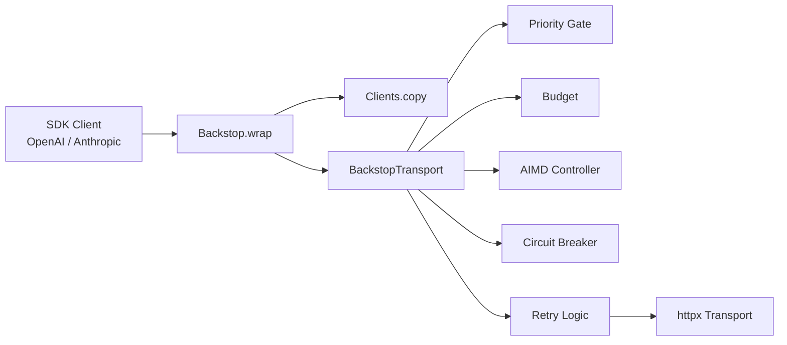

<div align="center">
  <h1>Backstop</h1>
  <p>
    <strong>In-process AI SDK backpressure, budgets, retries, circuit breaking, and metrics</strong>
  </p>
  <p>
    <a href="#features">Features</a> •
    <a href="#install">Install</a> •
    <a href="#usage">Usage</a> •
    <a href="#cli">CLI</a> •
    <a href="#metrics">Metrics</a> •
    <a href="#tests">Tests</a>
  </p>
  <p>
    
    
  </p>
</div>

Backstop wraps OpenAI and Anthropic Python SDK clients with in-process controls for safe, predictable AI API usage — token budgeting, priority-aware admission, AIMD concurrency control, retry handling, circuit breaking, and optional Prometheus metrics.

---

## Features

- **Token budget enforcement** — Reserve before dispatch, reconcile after response. Hard limits prevent runaway spend.
- **Priority admission** — `critical`, `default`, `background` queuing with starvation prevention.
- **AIMD concurrency** — Additive-increase/multiplicative-decrease adapts to provider pressure.
- **Retry with backoff** — Configurable attempts, jitter, and status codes (429/500/502/503/504/529).
- **Circuit breaker** — Trips on sustained failure, cooldowns automatically.
- **HTTP transport layer** — Plugs into the SDK's native `httpx` transport — no monkey-patching.
- **Prometheus metrics** — Optional export for dashboards and alerting.
- **Provider support** — OpenAI (sync & async) and Anthropic (sync & async).

---

## Install

```bash
# Base install
pip install backstop

# With Prometheus metrics
pip install "backstop[metrics]"

# With Anthropic support
pip install "backstop[anthropic]"

# Everything (dev)
pip install -e ".[test,metrics,anthropic]"
```

From source:
```bash
git clone https://github.com/RavaniRoshan/backstop.git
cd backstop
pip install -e ".[test,metrics,anthropic]"
```

---

## Usage

### OpenAI

```python
from openai import OpenAI
from backstop import Backstop, BackstopConfig

client = Backstop.wrap(
    OpenAI(api_key="sk-..."),
    budget=50_000,
    config=BackstopConfig(initial_concurrency=8),
)

response = client.chat.completions.create(
    model="gpt-4.1-mini",
    messages=[{"role": "user", "content": "Summarize this in one paragraph."}],
    extra_headers={"X-Backstop-Priority": "critical"},
)
```

Async:
```python
from openai import AsyncOpenAI
from backstop import Backstop

client = Backstop.wrap(AsyncOpenAI(api_key="sk-..."), budget=10_000)
```

### Anthropic

```python
from anthropic import Anthropic
from backstop import Backstop, BackstopConfig

client = Backstop.wrap(
    Anthropic(api_key="sk-ant-..."),
    budget=50_000,
    config=BackstopConfig(initial_concurrency=8),
)

response = client.messages.create(
    model="claude-sonnet-4-20250514",
    max_tokens=1024,
    messages=[{"role": "user", "content": "Summarize this in one paragraph."}],
    extra_headers={"X-Backstop-Priority": "critical"},
)
```

Async:
```python
from anthropic import AsyncAnthropic
from backstop import Backstop

client = Backstop.wrap(AsyncAnthropic(api_key="sk-ant-..."), budget=10_000)
```

> `budget=None` — unlimited pass-through. `budget=0` — blocks before dispatch.

---

## Priority

Set per-request priority via the `X-Backstop-Priority` header:

| Value | Behavior |
|---|---|
| `critical` | Admitted first — use for user-facing requests |
| `default` | Normal queue position |
| `background` | Lowest priority — yields to higher |

```python
extra_headers={"X-Backstop-Priority": "critical"}
```

---

## CLI

```bash
# Local mock-provider load scenarios
backstop harness --scenario burst
backstop harness --scenario steady-state
backstop harness --scenario error-storm
backstop harness --scenario budget-hit

# Prometheus metrics server
backstop metrics --port 9090

# Real API smoke tests (set API keys first)
backstop real-openai --model gpt-4.1-mini
backstop real-openai --async-client --api chat
backstop real-anthropic
backstop real-anthropic --async-client
```

---

## Metrics

Export Prometheus metrics by installing `backstop[metrics]`:

```python
from backstop import Backstop

# Start a standalone HTTP server
Backstop.start_metrics_server(port=9090)

# Or mount the WSGI app in your existing server
app = Backstop.metrics_app()
```

---

## Tests

```bash
# Unit tests (no API calls)
pytest

# Real OpenAI API (opt-in)
export OPENAI_API_KEY="sk-..."
pytest -m real_openai

# Real Anthropic API (opt-in)
export ANTHROPIC_API_KEY="sk-ant-..."
pytest -m real_anthropic
```

---

## Architecture



Backstop replaces the SDK's internal `httpx.Client` with a custom transport that intercepts every request. No monkey-patching, no thread hacks — just standard SDK http_client injection.

---

## License

MIT — see [LICENSE](LICENSE.txt) for details.

---

<p align="center">
  <sub>Built with httpx, openai, anthropic · Backstop Contributors</sub>
</p>
