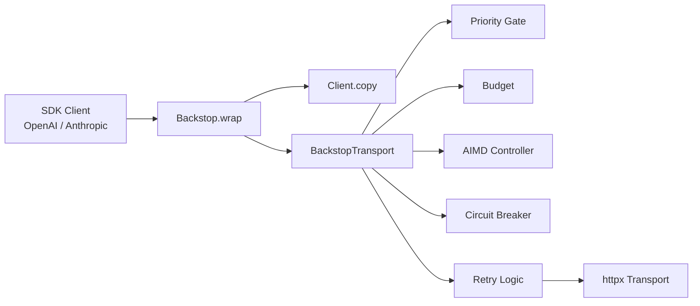

<div align="center">
  

  <p>
    <strong>In-process AI SDK backpressure, budgets, retries, circuit breaking, and metrics.</strong>
  </p>
  <p>
    <em>Verified: per-agent budget isolation that proves whether isolated agents converge on the same answer — the only LLM guardrail that measures its own claims.</em>
  </p>
  <p>
    <a href="#quick-start">Quick Start</a> •
    <a href="#features">Features</a> •
    <a href="#wedge-multi-agent-diff-cli">Wedge</a> •
    <a href="#architecture">Architecture</a> •
    <a href="#benchmarks">Benchmarks</a> •
    <a href="#verified-results">Verified Results</a> •
    <a href="CHANGELOG.md">Changelog</a> •
    <a href="CODE_OF_CONDUCT.md">Code of Conduct</a>
  </p>
  <p>
    
    
    
  </p>
</div>

## The Problem

Running a single AI coding agent is already expensive and unpredictable. Running three in parallel — which is what multi-agent architectures require — triples your runaway-cost exposure. Today, your options are:

1. **No protection** — hope the agent stops. Production teams usually discover spend controls after the first cost incident.
2. **Proxy gateway** — route all traffic through an external service. Adds latency, a single point of failure, and network complexity.

Backstop takes a third path: **SDK-native guardrails that live inside your process.** No proxy, no network hop, no monkey-patching. It replaces the SDK's internal `httpx` transport with a controlled pipeline — budget enforcement, circuit breaking, priority admission, retry logic — before any request leaves your application.

The Wedge tool (bundled in this repo) **proves** that this transport-layer isolation is sufficient to safely run multiple coding agents in parallel, each with its own budget and kill-switch — and measures whether those agents converge on the same answer. See [Verified Results](#verified-results).

---

## Quick Start

```bash
pip install "backstop[anthropic]"
```

Wrap any OpenAI or Anthropic client in one line:

```python
from openai import OpenAI
from backstop import Backstop

client = Backstop.wrap(OpenAI(), budget=50_000)

# Use the client exactly as before — Backstop intercepts at the transport layer
response = client.chat.completions.create(
    model="gpt-4.1-mini",
    messages=[{"role": "user", "content": "Hello."}],
)
```

```python
from anthropic import Anthropic
from backstop import Backstop

client = Backstop.wrap(Anthropic(), budget=50_000)

response = client.messages.create(
    model="claude-sonnet-4-20250514",
    max_tokens=1024,
    messages=[{"role": "user", "content": "Hello."}],
)
```

Run the multi-agent diff tool:

```bash
wedge run task.yaml
```

---

## Features

- **Token budget enforcement** — Reserve before dispatch, reconcile after response. Hard limits prevent runaway spend.
- **Priority admission** — `critical`, `default`, `background` priority with starvation prevention.
- **AIMD concurrency** — Additive-increase/multiplicative-decrease adapts to provider pressure.
- **Retry with backoff** — Configurable attempts, jitter, and status codes (429/500/502/503/504/529).
- **Circuit breaker** — Trips on sustained failure, cooldowns automatically.
- **Streaming support** — Wraps streaming responses while preserving budget reconciliation.
- **Tenant budgets** — Request-scoped tenant budget buckets via `with_budget(...)`.
- **Response caching** — Optional in-memory cache; opt-in **semantic (near-duplicate)** caching short-circuits reformatted/paraphrased prompts via a pluggable embedder (`cache_enabled=True, cache_semantic=True, cache_embedder=...`).
- **Hooks** — Lightweight before/after hooks for local logging, policy, and metadata.
- **HTTP transport layer** — Plugs into the SDK's native `httpx` transport — no monkey-patching.
- **Prometheus metrics** — Optional export for dashboards and alerting.
- **OpenTelemetry export** — Vendor-neutral metrics mirroring the Prometheus series (`pip install "backstop[otel]"`, `BackstopConfig(otel_enabled=True)`).
- **Shared (Redis) budget** — Enforce *one* token budget across processes and replicas with zero infra (`pip install "backstop[redis]"`, `BackstopConfig(shared_budget=True)`).
- **In-process fallback chain** — On a sustained provider failure, walk an ordered `fallback_chain` of backup models/deployments *inside your process*; `fallback_chain_for_priority` gives critical traffic its own chain (`BackstopConfig(fallback_chain=[{"model": ...}, {"model": ..., "base_url": ...}])`). The legacy single `fallback_model` is still supported.
- **CLI ergonomics** — `backstop doctor` validates your install; `backstop benchmark` produces reproducible proof.
- **Provider support** — OpenAI (sync & async) and Anthropic (sync & async).
- **TypeScript SDK** — `@ravanish/backstop` brings the same drop-in `wrap()` (budget + circuit breaker + retry + fallback) to Node.js agents (`ts/backstop`).

---

## Wedge: Multi-Agent Diff CLI

Wedge is a sandboxed execution environment bundled with Backstop. It runs N isolated coding agents against the same task, wraps each in its own Backstop session, and diffs their output to measure convergence.

**Why this exists:** Testing whether isolated multi-agent execution with transport-layer budget isolation reduces runaway-cost exposure in coding agents.

```
Wedge tool (isolated multi-agent diff CLI)
        │
        ├──► Runner A: Backstop.wrap(Anthropic(), budget=20_000)
        ├──► Runner B: Backstop.wrap(Anthropic(), budget=20_000)
        └──► Runner C: Backstop.wrap(Anthropic(), budget=20_000)
                        │
              (each runner = one Backstop session,
               own budget, own kill-switch —
               isolated CONTEXT, not isolated INFRA)
```

Each runner gets:
- Its own `Backstop.wrap()` session — independent budget, independent circuit breaker
- Its own isolated working directory (simulated git worktree)
- No shared conversation history with other runners

After all runners complete, the diff engine scores patch similarity across all outputs:

| Status | Meaning |
|---|---|
| `CONVERGED` | All patches identical (similarity = 1.00) |
| `PARTIAL` | Patches share >80% similarity |
| `DIVERGED` | Patches differ significantly (<80%) |

### Example: Running Wedge

```yaml
# task.yaml
name: "Refactor to class-based"
prompt: "Refactor the main.py file to use a class-based approach."
test_command: "pytest tests/"
runners: 3
provider: "anthropic"   # or "openai"
```

```bash
$ cd wedge-test-fixture && wedge run task.yaml
Running task: Refactor to class-based Item with 3 concurrent runners (anthropic)...
Comparing patches...
Done! Report saved to wedge_report.md

Convergence Summary:
  main.py: PARTIAL (sim=0.98)

Tests passed: 3/3
```

The report includes each runner's Backstop budget usage — real usage evidence that per-agent budget isolation holds under convergence pressure.

---

## What This Is NOT

Backstop deliberately avoids:

- **Not a proxy/gateway** — No network hop. Runs entirely in-process.
- **Not an MCP tool** — Protocol-agnostic. Works with any SDK client that uses `httpx`/`requests`.
- **Not an observability platform** — It exports Prometheus *and* OpenTelemetry metrics; it doesn't store, query, or visualize them.
- **Not an application-layer tool** — It does not consume signals like "disagreement" or "confidence." It operates at the transport layer only.
- **Not a caching layer** — Optional response caching exists for convenience, not as a primary feature.

Wedge deliberately avoids:

- **Not a production agent framework** — Wedge is a focused verification tool for per-agent isolation and convergence measurement, not a general agent framework. Semantic (token/line-normalized) diffing is included; full AST diffing is a future enhancement.

---

## Production Reliability

Backstop is drop-in *and* production-grade: it closes the gap vs proxy
gateways (LiteLLM/BricksLLM) while staying in-process.

### Shared budget across replicas (P1)

A single token budget enforced across processes/replicas — the "AI SaaS team
with runaway spend" wedge. No Postgres, no Redis admin, no network hop:

```bash
pip install "backstop[redis]"
```

```python
from openai import OpenAI
from backstop import Backstop, BackstopConfig

client = Backstop.wrap(
    OpenAI(),
    budget=1_000_000,
    config=BackstopConfig(shared_budget=True, redis_url="redis://localhost:6379"),
)
```

Every `wrap()` session in every process decrements the *same* Redis key via
atomic Lua scripts, so N replicas cannot overspend one cap beyond tolerance.

### OpenTelemetry export (P2)

Mirror every Prometheus series to a vendor-neutral OTel meter (Datadog,
Honeycomb, CloudWatch — any OTLP collector):

```bash
pip install "backstop[otel]"
```

```python
client = Backstop.wrap(
    OpenAI(),
    budget=50_000,
    config=BackstopConfig(otel_enabled=True),
)
```

### In-process fallback (P3)

On a sustained provider failure (circuit open), retry once against a backup
model/deployment *within your process* — no proxy, no extra infra:

```python
client = Backstop.wrap(
    OpenAI(),
    budget=50_000,
    config=BackstopConfig(
        fallback_model="gpt-4o-mini",
        fallback_base_url="https://backup-gateway.example.com/v1",  # optional
    ),
)
```

### CLI ergonomics

```bash
backstop doctor      # validate install, SDKs, keys, wrap smoke test
backstop benchmark   # deterministic, seeded proof (--publish to commit results)
```

---

## Documentation

- [Concurrency & Scale Limits](docs/concurrency.md) — the GIL ceiling, the
  configurable `max_wrap_sessions` cap, and when a proxy gateway is the better
  fit.
- [Competitive benchmark: Backstop vs. LiteLLM/BricksLLM (2026-07-20)](docs/competitive-benchmark-2026-07-20.md)
  — Firecrawl-sourced feature matrix and the "10× better" wedge.
- [Deep Research: Making Backstop a 10× Better LLM Guardrail (2026-07-20)](docs/deep-research-10x-better-2026-07-20.md)
  — exhaustive, 6-agent Firecrawl synthesis across gateways, observability,
  frameworks, clouds, in-process techniques, and contrarian risks, with a
  prioritized 10× roadmap.
- [Published benchmark results (2026-07-20)](docs/benchmark-results-2026-07-20.md)
  — deterministic, reproducible proof from `backstop benchmark`.

## Architecture

### Backstop Transport Pipeline


```mermaid
graph LR
    A[SDK Client<br/>OpenAI / Anthropic] --> B[Backstop.wrap]
    B --> C[Client.copy]
    B --> D[BackstopTransport]
    D --> E[Priority Gate]
    D --> F[Budget]
    D --> G[AIMD Controller]
    D --> H[Circuit Breaker]
    D --> I[Retry Logic]
    I --> J[httpx Transport]
```

Backstop replaces the SDK's internal `httpx.Client` with a custom transport that intercepts every request. No monkey-patching, no thread hacks — just standard SDK `http_client` injection.

### Wedge Multi-Runner Architecture

```
┌─────────────────────────────────────────────────┐
│  wedge run task.yaml                            │
│                                                 │
│  ┌──────────┐  ┌──────────┐  ┌──────────┐      │
│  │ Runner A │  │ Runner B │  │ Runner C │      │
│  │          │  │          │  │          │      │
│  │ Backstop │  │ Backstop │  │ Backstop │      │
│  │ budget:  │  │ budget:  │  │ budget:  │      │
│  │  20,000  │  │  20,000  │  │  20,000  │      │
│  └────┬─────┘  └────┬─────┘  └────┬─────┘      │
│       │              │              │            │
│       ▼              ▼              ▼            │
│  ┌─────────────────────────────────────────┐    │
│  │         Provider API (shared)           │    │
│  │     Anthropic / OpenAI endpoints        │    │
│  └─────────────────────────────────────────┘    │
│                                                 │
│  ┌─────────────────────────────────────────┐    │
│  │  Diff Engine → Convergence Report       │    │
│  └─────────────────────────────────────────┘    │
└─────────────────────────────────────────────────┘
```

Key: **isolated context, not isolated infrastructure.** All runners share the same process and event loop. Isolation lives at the conversation/budget layer, enforced by Backstop's transport wrapper.

---

## Install

Backstop is published on PyPI. Pick the install that matches how you'll use it.

```bash
# Most users — OpenAI + Anthropic support in one line
pip install "backstop[anthropic]"

# Metrics (Prometheus export) only
pip install "backstop[metrics]"

# Base library (OpenAI only) — add [anthropic] for Claude support
pip install backstop
```

Run either CLI **without a permanent install** (great for a quick try or CI) —
`pipx` fetches Backstop into a throwaway environment and runs it:

```bash
pipx run backstop --help      # Backstop harness / metrics server
pipx run wedge --help         # Wedge multi-agent diff tool
```

If you don't have pip set up at all, the one-command installer detects Python
and installs Backstop for you (secondary / convenience path):

```bash
curl -fsSL https://raw.githubusercontent.com/RavaniRoshan/backstop/main/install.sh | sh
```

Canonical install remains `pip install "backstop[anthropic]"` (see
[docs/install.md](docs/install.md) for the full matrix).

Isolated, persistent installs (recommended for the `backstop` / `wedge` commands):

```bash
pipx install backstop
```

Every path here is `pip`/`pipx` or the curl convenience installer above — no npm.
`pip install "backstop[anthropic]"` is the canonical install; the curl one-liner is
a secondary option for users without pip/Python knowledge.
See [docs/install.md](docs/install.md) for the full end-user + enterprise matrix
(internal-mirror, pinned, air-gapped, and container paths).

### From source / development

```bash
git clone https://github.com/RavaniRoshan/backstop.git
cd backstop
pip install -e ".[test,metrics,anthropic]"
```

---

## Usage

### OpenAI

```python
from openai import OpenAI
from backstop import Backstop, BackstopConfig

client = Backstop.wrap(
    OpenAI(api_key="sk-..."),
    budget=50_000,
    config=BackstopConfig(initial_concurrency=8),
)

response = client.chat.completions.create(
    model="gpt-4.1-mini",
    messages=[{"role": "user", "content": "Summarize this in one paragraph."}],
    extra_headers={"X-Backstop-Priority": "critical"},
)
```

Async:
```python
from openai import AsyncOpenAI
from backstop import Backstop

client = Backstop.wrap(AsyncOpenAI(api_key="sk-..."), budget=10_000)
```

### Anthropic

```python
from anthropic import Anthropic
from backstop import Backstop, BackstopConfig

client = Backstop.wrap(
    Anthropic(api_key="sk-ant-..."),
    budget=50_000,
    config=BackstopConfig(initial_concurrency=8),
)

response = client.messages.create(
    model="claude-sonnet-4-20250514",
    max_tokens=1024,
    messages=[{"role": "user", "content": "Summarize this in one paragraph."}],
    extra_headers={"X-Backstop-Priority": "critical"},
)
```

Async:
```python
from anthropic import AsyncAnthropic
from backstop import Backstop

client = Backstop.wrap(AsyncAnthropic(api_key="sk-ant-..."), budget=10_000)
```

> `budget=None` — unlimited pass-through. `budget=0` — blocks before dispatch.

### Tenant Budgets

```python
from backstop import TenantBudget, budgets, with_budget

budgets.register({
    "tenant_123": TenantBudget("tenant_123", limit_tokens=50_000),
})

with with_budget("tenant_123"):
    client.chat.completions.create(...)
```

### Priority

Set per-request priority via the `X-Backstop-Priority` header:

| Value | Behavior |
|---|---|
| `critical` | Admitted first — use for user-facing requests |
| `default` | Normal queue position |
| `background` | Lowest priority — yields to higher |

### Hooks

`BackstopConfig` is a frozen dataclass, so pass `before_request` / `after_response`
callbacks to its **constructor** — you cannot assign them to a config instance
after the fact (that raises `FrozenInstanceError`):

```python
from openai import OpenAI
from backstop import Backstop, BackstopConfig

def on_request(hook):
    print("->", hook.endpoint, "est", hook.estimated_tokens)

def on_response(hook):
    print("<-", hook.status_code, "used", hook.actual_tokens)

client = Backstop.wrap(
    OpenAI(api_key="sk-..."),
    budget=50_000,
    config=BackstopConfig(before_request=on_request, after_response=on_response),
)
```

`hook.metadata` is a copy of the Backstop request headers; read (and mutate, in
`before_request`) it to carry request-scoped context such as the active tenant
from `get_current_tenant()`.

---

## CLI

```bash
# Backstop harness scenarios
backstop harness --scenario burst
backstop harness --scenario error-storm
backstop harness --scenario budget-hit

# Prometheus metrics server
backstop metrics --port 9090

# Real API smoke tests (set API keys first)
backstop real-openai --model gpt-4.1-mini
backstop real-anthropic

# Wedge multi-agent diff
wedge run task.yaml
```

## Examples

Runnable examples live in [`examples/`](examples/):

**Backstop:**
- [`openai_sync.py`](examples/openai_sync.py) — Sync OpenAI with budget
- [`openai_async.py`](examples/openai_async.py) — Async OpenAI
- [`anthropic_sync.py`](examples/anthropic_sync.py) — Sync Anthropic with budget
- [`anthropic_async.py`](examples/anthropic_async.py) — Async Anthropic
- [`fastapi_tenants.py`](examples/fastapi_tenants.py) — Multi-tenant FastAPI
- [`background_priority.py`](examples/background_priority.py) — Priority queuing
- [`prometheus_metrics.py`](examples/prometheus_metrics.py) — Metrics export
- [`budget_blocking_demo.py`](examples/budget_blocking_demo.py) — Budget exhaustion

**Wedge:**
- [`wedge_basic.py`](examples/wedge_basic.py) — 3 Anthropic runners, diff output
- [`wedge_openai.py`](examples/wedge_openai.py) — 3 OpenAI runners, diff output

---

## Benchmarks

Backstop overhead is measured separately from provider latency using a local mock transport.

| Metric | Direct | Backstop | Overhead |
|---|---:|---:|---:|
| p50 latency | 0.13 ms | 0.26 ms | **0.12 ms** |
| p95 latency | 0.25 ms | 0.43 ms | **0.18 ms** |
| p99 latency | 0.35 ms | 0.58 ms | **0.23 ms** |

Key scenario results (deterministic: local mock transport, fixed seed `0xC0FFEE`, reproducible via `backstop benchmark`):

| Scenario | Requests | Provider Calls | Successes | Provider Errors | Budget-Blocked | Circuit-Blocked |
|---|---:|---:|---:|---:|---:|---:|
| **Burst** | 50 | 50 | 50 | 0 | 0 | 0 |
| **Steady-State** | 30 | 30 | 30 | 0 | 0 | 0 |
| **Error Storm** | 50 | 12 | 8 | 0 | 0 | 42 |
| **Budget Hit** | 80 | 17 | 17 | 0 | 63 | 0 |

Per-run counts are exact and reproducible — the seeded harness removes the
randomized error injection that made earlier runs non-deterministic. Re-run
any time to confirm:

```bash
backstop benchmark --publish   # writes docs/benchmark-results-<date>.md
```

Full results: [`docs/benchmark-results-2026-07-20.md`](docs/benchmark-results-2026-07-20.md) · Methodology: [`docs/benchmarks.md`](docs/benchmarks.md)

---

## Metrics

Export Prometheus metrics by installing `backstop[metrics]`:

```python
from backstop import Backstop

# Start a standalone HTTP server
Backstop.start_metrics_server(port=9090)

# Or mount the WSGI app in your existing server
app = Backstop.metrics_app()
```

Starter observability assets:
- [`observability/grafana/backstop-dashboard.json`](observability/grafana/backstop-dashboard.json)
- [`observability/prometheus-alerts.yml`](observability/prometheus-alerts.yml)

---

## Verified Results

Every claim below is backed by live-provider evidence. Re-run any time to confirm.

| Claim | Evidence | Reproduce |
|---|---|---|
| **Budget isolation** — each `Backstop.wrap()` enforces an independent budget | Live: Agent A (300 tokens) blocked independently of Agent B (5000 tokens) | `python proofs/proof_multi_agent_isolation.py` |
| **Budget exhaustion prevention** — blocks before overspend | Live: 2 calls allowed (448 tokens), 18 blocked at 500-token cap | `python proofs/proof_budget_exhaustion.py` |
| **Sub-ms overhead** — in-process, no network hop | Measured: **0.10 ms p50** (mock), ~1.1s on 13s reasoning call | `backstop benchmark` |
| **Semantic cache** — near-duplicate prompts served from cache | Live + mock: reformatted prompts short-circuited without provider call | `python proofs/proof_semantic_cache.py` |
| **Convergence measurement** — does isolated agents produce the same answer? | Demo: 3 runners → **PARTIAL (sim=0.98)** | `cd wedge-test-fixture && wedge run task.yaml` |

Full evidence data: [`docs/proof-evidence-2026-08-10.md`](docs/proof-evidence-2026-08-10.md) · Marketing-safe claims: [`docs/marketing-evidence-2026-08-10.md`](docs/marketing-evidence-2026-08-10.md)

---

## Tests

```bash
# Unit tests (no API calls)
pytest

# Real OpenAI API (opt-in)
export OPENAI_API_KEY="sk-..."
pytest -m real_openai

# Real Anthropic API (opt-in)
export ANTHROPIC_API_KEY="sk-ant-..."
pytest -m real_anthropic
```

---

## Trust And Security

- [Architecture](docs/architecture.md)
- [Threat model](docs/threat-model.md)
- [Compatibility matrix](docs/compatibility.md)
- [Security policy](SECURITY.md)
- [Contributing guide](CONTRIBUTING.md)
- [Code of Conduct](CODE_OF_CONDUCT.md)
- [Changelog](CHANGELOG.md)

---

## License

MIT — see [LICENSE](LICENSE.txt) for details.

---

<p align="center">
  <sub>Built with httpx, openai, anthropic · Backstop Contributors</sub>
</p>
