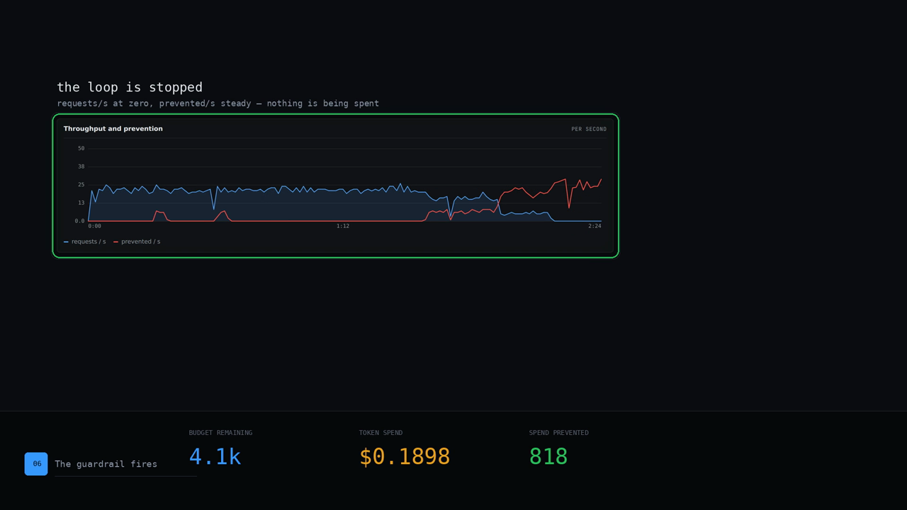
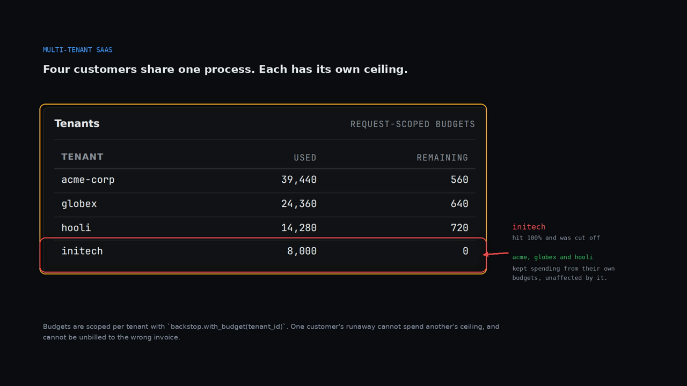

# Use cases

Backstop is an in-process guardrail for the OpenAI and Anthropic SDKs: you wrap
the client once and it enforces token budgets, priority admission, concurrency
ceilings, circuit breaking and retry policy before and after every provider call,
with no network hop and no call-site changes. As a side effect of the traffic it
already mediates, it can write a priced, attributed spend ledger to a file — so
the same deployment that stops a runaway agent can also tell finance which team
spent the money.

Five situations, five different people, and each one is now shown on the surface
where it actually happens: the dashboard's own Tenants, Sessions and throughput
panels, or the real `backstop` CLI. Every number on screen comes from the product
running — the dashboard frames are Chromium screenshots of `backstop dashboard
--demo` and of a harness that registers genuine per-tenant budgets, and the
terminal frames are verbatim stdout of the real commands. Where a number is a
scenario for the fictional company in the caption, the `usecase.md` says so.

The previous set was five variations on one synthetic terminal canvas, rendered
as 256-colour GIF. That format was the reason they looked broken: a 256-entry
palette dithers badly over a dark UI, and a 12.9MB animated GIF gets resampled
into mush by anything that downsamples it. These are H.264 MP4 — full colour, a
fraction of the pixels' weight, and no palette. The stills below are the posters;
each links to the video.

## The whole thing, end to end

A 132-second walkthrough: the problem, the one call that fixes it, the dashboard
watching a real budget drain, the guardrail firing, per-agent ceilings, the
ledger, and reconciling the ledger against a statement.

[](./walkthrough.mp4)

---

## Flagship — the chargeback

**A backend architect at a ~500-person AI company with a six-figure invoice and
no way to answer "which team spent it."**

[](./major-end-to-end/demo.mp4)

→ [Read the full use case](./major-end-to-end/usecase.md)

---

## Multi-tenant SaaS — isolate one tenant's blast radius

**A backend architect at a ~200-person multi-tenant AI SaaS whose customers
share one pool, one process and one provider account.**

[](./multi-tenant-saas/demo.mp4)

→ [Read the full use case](./multi-tenant-saas/usecase.md)

---

## Agent fleet SLO — protect a p99 under load

**The platform / SRE lead at an ~800-person company running an agent fleet
against a 2-second p99 SLO through a 10x spike and a provider 429 storm.**

[](./agent-fleet-slo/demo.mp4)

→ [Read the full use case](./agent-fleet-slo/usecase.md)

---

## Runaway eval loop — catch the loud blowup and the silent regression

**An AI/ML engineer iterating prompts and running eval loops, whose recursive
agent loop burned a night of budget and whose prompt edit tripled cost per task
without anyone noticing for a fortnight.**

[](./runaway-eval-loop/demo.mp4)

→ [Read the full use case](./runaway-eval-loop/usecase.md)

---

## Audit and compliance — prove it

**A security & compliance engineer at a ~1200-person regulated fintech, where
finance will not sign off on unreconcilable AI spend and legal will not approve
prompts leaving the host.**

[](./audit-and-compliance/demo.mp4)

→ [Read the full use case](./audit-and-compliance/usecase.md)

---

## About these videos

Each one is assembled by [`_build/media/`](./_build/media/) from captures of the
product running, and the source of every frame is stated above.

**The dashboard frames are real.** `backstop dashboard --demo` was started, the
workload was allowed to drain a real budget, and Chromium screenshotted the live
page at scripted seconds — full-page frames for the timelapses, and CSS-selector
element captures for the panels, so a focus ring lands on the pixels it names
rather than on coordinates someone guessed. The per-tenant frame comes from a
harness that registers genuine `TenantBudget`s and drives real requests through
wrapped `openai` clients under `with_budget(...)`; `initech` really does exhaust
its own ceiling while the other three keep spending.

**The terminal frames are real.** They are the verbatim stdout of
`backstop demo`, `backstop ledger demo` and `backstop reconcile --demo`, captured
by running them. The compositor refuses to render any text that a capture did not
write, so a scene cannot drift into paraphrasing the product.

**The motion is ours.** Cuts, the focus rings, the arrows, the column bands, the
lower-thirds and the caption timing. Nothing in a frame is a mock-up of a screen
the product does not have — the earlier set was, which is why this set replaced
it.

Rebuild them with `python3 _build/media/flagship.py` and
`python3 _build/media/usecases.py` after re-running the capture step; the inputs
they read are listed at the top of each file.

If you want the real thing rather than a picture of it:

```bash
pip install "backstop-ai"
backstop verify        # eight offline mechanism checks, no key, no network
backstop ledger demo   # a priced chargeback, byte-identical across runs
```
