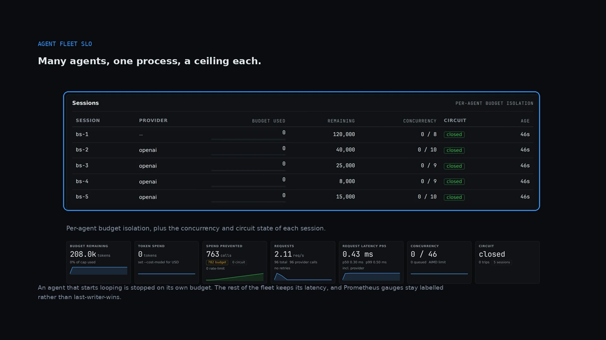

# Fleet SLO: a 10x spike and a 429 storm against a 2-second p99

Kestrel is an ~800-person company on Series C running an agent fleet. At 09:12
traffic went up 10x and the provider started returning 429s; the fleet had no
concurrency ceiling of its own, so every worker called the provider at once and
the p99 walked straight through its 2.0-second SLO. The only thing limiting the
fleet was the provider's queue. Backstop puts the ceiling back: three-level
priority admission, AIMD concurrency, a circuit breaker that fails fast, and a
`queue_timeout` so a waiter gets an error rather than silence.

[](./demo.mp4)

## The situation

A fleet of agents calling a rate-limited API has a latency SLO and a provider
that will say no. Three things have to be true at once under a 10x spike, and
the naive implementation gets none of them:

- **There must be a ceiling.** Without `initial_concurrency` / `max_concurrency`,
  N workers issue N simultaneous requests, every one of them queues inside the
  provider, and the queueing time is charged to your p99 as if it were model
  time. The fleet is the queue.
- **The right work must go first.** Interactive work and batch re-scoring do not
  have the same deadline, and a ceiling alone treats them identically.
- **A 429 must not become a retry storm.** Every retry against a provider that
  is already saying "no" makes the p99 worse and the quota worse at the same
  time.

The uncomfortable part is what a *shedding* policy would cost: dropping a
background job is fast, correct for the SLO, and destroys a customer's work.
Backstop deliberately does not do it.

## What backstop does here

- **Three priorities, and no `normal`.** `backstop.Priority` is exactly
  `critical`, `default`, `background`. The transport reads
  `X-Backstop-Priority` per request (`extract.py`), so a fleet can label work
  without touching the call site.
- **A priority queue, not a shedding policy.** When the AIMD limit is reached,
  `PriorityGate.acquire()` blocks the caller for a slot. Selection prefers
  `critical`, then the oldest ticket that has waited at least
  `starvation_after_seconds`, then `default`, then `background`. **Nothing is
  cancelled or discarded** — a starved `background` ticket is released rather
  than waiting forever behind a stream of `critical` ones. Set
  `starvation_after_seconds=0` to disable that, and `queue_timeout` to bound how
  long any request will wait before it gets an error instead.
- **AIMD concurrency.** `initial_concurrency` (default 8) and
  `max_concurrency` (default 64), with `aimd_increase=1` on success,
  `aimd_decrease_factor=0.5` on pressure, floored at `min_concurrency=1`, and at
  most one step per `aimd_adjustment_interval` (default 5.0s) in either
  direction.
- **Quota-aware pre-emption.** `quota_aware=True` is the default. After every
  response the transport parses `x-ratelimit-*` and
  `anthropic-ratelimit-*` headers and clamps the AIMD limit from the outside,
  bypassing the adjustment-interval throttle — so a quota warning takes effect on
  the very next request rather than after the 429s arrive.
- **A breaker that fails fast.** `circuit_failure_threshold=0.20` over
  `circuit_window_seconds=60.0` (with `circuit_min_requests=5`) opens the
  circuit; `circuit_cooldown_seconds=30.0` later it goes half-open and admits
  exactly one probe; a success closes it, a failure re-opens it. Requests during
  the open window raise `CircuitBreakerOpenError` instead of paying for another
  refused call.
- **Retries that belong to the guardrail.** Wrapping sets the wrapped client to
  `max_retries=0` and Backstop's own transport does the retrying, with its own
  backoff and circuit state, because a guardrail that cannot see an individual
  attempt cannot stop it. `retry_statuses` includes 429.
- **The latency split you need to debug with.** Each request's metadata carries
  `total_latency_ms`, `queue_wait_ms` and `provider_latency_ms =
  total - queue_wait`, and Prometheus exposes `backstop_queue_wait_seconds`,
  `backstop_queue_depth`, `backstop_concurrency_active` and
  `backstop_concurrency_limit`.

## What you see in the demo

- **Cold open** — 10x traffic, a provider 429 storm, and a 2.0s p99 SLO the
  fleet is already queueing through.
- **Submit** — `backstop harness --scenario error-storm`: a local mock provider
  at a 60% error rate, no key, no network.
- **Stream** — reads `services/agent/runner.py`, sets
  `initial_concurrency=8, max=64`, and the AIMD step with its
  `aimd_adjustment_interval=5.0` throttle.
- **Admission** — `critical | default | background`, the
  `X-Backstop-Priority` header, `Gate.acquire(critical)` taking the next freed
  slot, `Gate.acquire(background)` *waiting* rather than being discarded, and
  `starvation_after_seconds=1.0` releasing the oldest ticket even behind a
  critical one.
- **The trip** — a real `CircuitBreakerOpenError` from the storm, the
  `circuit_failure_threshold=0.20` that opened it, and the
  `OPEN → 30s cooldown → one probe` path. The harness figures on screen (50
  attempted, 12 provider calls, 8 successes, 42 circuit-blocked, final
  concurrency limit 4) are this tree's real `error-storm` output.
- **The honest beat** — it queues, it does not shed; `queue_timeout` defaults to
  `None`, so by default a waiter can wait indefinitely; and
  `total - queue_wait = provider_latency_ms` is how you tell queueing from
  slowness.
- **Dense resolution** — AIMD 8 → 4, the quota-aware clamp, a queue of depth 12
  (8 background, 4 default, 0 critical), and a p99 of 1.9s against the 2.0s
  SLO.
- **End card** — 42 failed fast, 12 provider calls for 50 requests. Queued, not
  shed. Starved, not lost.

## The commands

```bash
pip install "backstop-ai[anthropic]"

# the command in the GIF: a local mock-provider load scenario, offline
backstop harness --scenario error-storm
backstop harness --scenario burst
backstop harness --scenario steady-state

# reproduce the committed overhead table on your host
backstop benchmark
```

The configuration the demo is describing:

```python
client = Backstop.wrap(
    Anthropic(),
    budget=2_000_000,
    config=BackstopConfig(
        initial_concurrency=8,
        max_concurrency=64,
        min_concurrency=1,
        aimd_increase=1,
        aimd_decrease_factor=0.5,
        aimd_adjustment_interval=5.0,
        quota_aware=True,                    # the default
        starvation_after_seconds=1.0,
        queue_timeout=2.0,                   # a waiter gets an error, not silence
        circuit_failure_threshold=0.20,
        circuit_cooldown_seconds=30.0,
    ),
)
```

And the priority, per request, with no call-site change:

```python
client.chat.completions.create(
    model="claude-sonnet-4",
    messages=[...],
    extra_headers={"X-Backstop-Priority": "critical"},
)
```

## What this does NOT solve

- **It does not shed, and it does not drop your work.** If your SLO needs hard
  rejection of low-priority traffic, this is the wrong tool: a `background` ticket
  waits, and with `queue_timeout=None` (the default) it waits indefinitely.
  Raising `critical` traffic does not shrink the queue; it just moves you to the
  front of it.
- **`queue_timeout=None` is the default, so an unbounded wait is the default.**
  Set it if your callers need a bounded answer.
- **The GIL is still the ceiling.** All Backstop logic runs under CPython's global
  interpreter lock. `docs/concurrency.md` is explicit that 10/20/50 concurrent
  `wrap()` sessions in one process is fine for typical request workloads and that
  hundreds of CPU-bound synchronous sessions serialize and degrade tail latency.
  The same page's advice is one process per agent or per tenant, and
  `max_wrap_sessions` is a soft warning, not a limit.
- **Local mode is per process.** Replicas have separate budgets and separate
  circuit state unless you use the `redis` extra for the budget. Per-process
  circuit state differing across containers is a documented limitation, not a bug.
- **The harness numbers for `error-storm` and `budget-hit` do not reproduce
  reliably.** The `burst` and `steady-state` counts do. `error-storm` and
  `budget-hit` turn on retry backoff and circuit cooldown, which are wall-clock
  timers — the committed snapshot's `error-storm` row (15 provider calls, 11
  successes, 39 circuit-blocked) does not reproduce on the current tree, which
  reports 12 / 8 / 42. Compare those two rows as indicative, never as a diff.
  Latency percentiles are wall-clock and will never match a snapshot.
- **The p99, the queue depth and the latency split in the demo are this fleet's
  scenario**, not a measurement. Backstop contributes the ceiling, the
  ordering, the breaker and the split; it does not make a slow model fast.
- **Not a multi-provider router.** Use LiteLLM or similar for cross-provider
  fallback; Backstop's fallback chain stays within one provider.
- **No hosted control plane and no SLO product.** Metrics are yours to ship;
  Backstop emits them and you send them to your own backend. There is no
  dashboard that reads them for you, and `docs/architecture.md` lists the
  control plane as direction rather than roadmap.

## Where to read more

- [`docs/architecture.md`](../../docs/architecture.md) — the request flow, and
  the "Priority admission" section in full.
- [`docs/concurrency.md`](../../docs/concurrency.md) — the GIL ceiling,
  `max_wrap_sessions`, and when to reach for a proxy instead.
- [`src/backstop/admission.py`](../../src/backstop/admission.py) — the gate, the
  three deques and the starvation rule.
- [`src/backstop/aimd.py`](../../src/backstop/aimd.py) — the controller, and
  `apply_external_decrease` for quota pressure.
- [`src/backstop/quotas.py`](../../src/backstop/quotas.py) — the rate-limit
  headers it reads.
- [`docs/threat-model.md`](../../docs/threat-model.md) — distributed
  split-brain, and the `redis` extra's coverage gap.
- [`usecases/README.md`](../README.md) — the other use cases.
