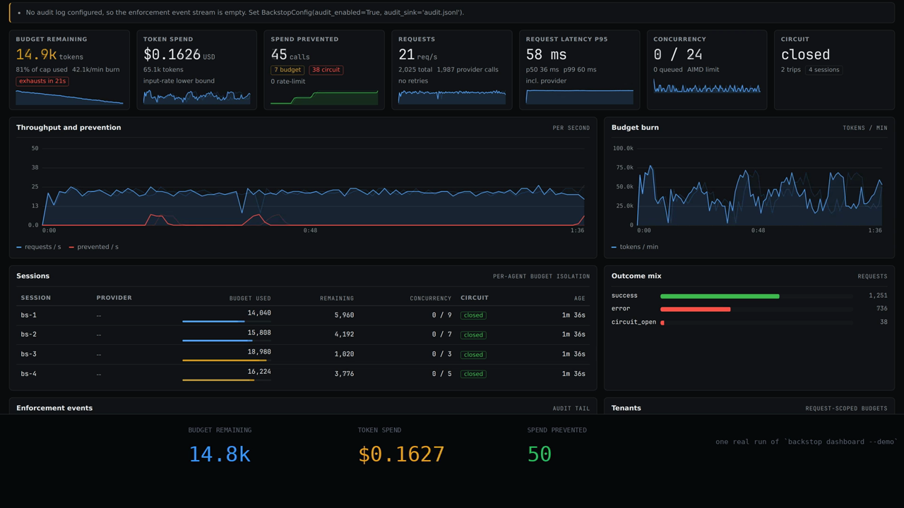

# The chargeback: a six-figure invoice nobody can attribute

Acme is a ~500-person AI company. The provider invoice closed at six figures and
the backend architect who owns the agent cannot answer one question: which team
spent it. 1,967 requests went out on 2026-09-26 across six teams and features,
$34.56 in the demo's synthetic window, and 69 of those requests — $1.54, 4.45% of
priced spend — declared no team at all, so nobody can be charged for that money.
Backstop does not fix this with a better chart. It fixes it by making the answer
a file, and by printing the part it could not measure next to the part it could.

[](./demo.mp4)

## The situation

A provider invoice is a total. A chargeback needs a dimension. Without one, the
only two available answers are "here is the number, split evenly" and "here is
the number, and we cannot tell you who spent it" — and the second one is what
finance actually hears today, because the request path did not keep the
attribution that the invoice format requires.

The failure is invisible in the product and expensive outside it. Nothing breaks
when a call site forgets to declare itself. The token count is identical, the
latency is identical, the response is identical. The only symptom is a row that
cannot be assigned, thirteen weeks later, to a team that cannot be asked.

## What backstop does here

- **One flag.** `BackstopConfig(ledger_enabled=True, ledger_path="ledger.jsonl")`.
  Every completed provider request then produces one priced, attributed record.
  It is **off by default**, and with it off the whole per-request cost is one
  truth test and no event is built.
- **`SpendEvent`, frozen and validated at construction.** 18 declared fields;
  `schema_version` is the literal `"1.0"`; `occurred_at` is fixed-width RFC 3339
  UTC with six fractional digits, so string order is chronological order. A
  persisted line must carry exactly those 18 fields — an unknown key and a
  missing key are both `ValueError`s naming every offender, so a typo or a
  truncation cannot reload as plausible data. `SpendEvent.from_dict(event.to_dict())`
  round-trips exactly.
- **Money as strings, in `Decimal`, end to end.** Every amount crosses the wire
  as a string (`"0.010000"`), never a JSON number, because a JSON number reads
  back as a binary float and an export that loses cents is worse than one that is
  awkward to parse. The arithmetic runs under the ledger's own 28-digit
  `decimal` context with `ROUND_HALF_UP` — a context is process-global and a
  library cannot ask the host to leave it alone, so an application that tightened
  `prec` would otherwise void every cost here silently.
- **Attribution you declare once.** `attribution(team=..., feature=...)` as a
  context manager, `with_attribution(...)` as a decorator, and
  `current_attribution()` to read it back — all three import from `backstop`.
  Thirteen optional dimensions. It is a `ContextVar`, so it follows `asyncio`
  tasks and any thread-pool submission that copies context (a bare
  `executor.submit` does not, and `docs/ledger.md` gives the `copy_context()`
  recipe). **A process that declares nothing records an all-`None`
  `Attribution`**, so no existing call site has to change.
- **Three-layer price resolution, no guessing.** Precedence highest-wins: a
  per-call `price_overrides` override, then your `price_catalog_path` file
  (`price_source="user"`, checked at construction so a typo fails at `wrap()`),
  then the bundled table. Name resolution is three tiers: the exact string, then
  the name with a trailing snapshot marker stripped repeatedly
  (`-2024-08-06`, `-20241022`, `-latest`), then a fixed alias map. **An unknown
  model is `None`, not a guess**: `compute_cost` returns `None`, the event is
  recorded with `cost=None`, and the export counts it in `unpriced_requests`.
- **A chargeback aggregator and an RFC 4180 CSV.** `build_chargeback(events,
  group_by=("team", "feature"))` produces one row per group, largest total first.
  `group_by` is validated against the 13 `Attribution` fields, so an unknown one
  is an error rather than a silently dropped column. **No totals row in the
  CSV** — a totals line inside a table somebody intends to `SUM` is a double
  count waiting to happen. An unset group key renders as `(unattributed)`, never
  as a blank cell, because a blank cell is the one thing that hides it.
- **The wedge, keyless and offline.** `backstop ledger demo` needs no key, no
  network, no file, is byte-identical across runs, and prints the same table every
  time.

## What you see in the demo

- **Cold open** — 1,967 requests since midnight. The invoice closed. Nobody can
  attribute it.
- **Submit** — `backstop ledger demo --group-by team,feature`. Offline, no key,
  no network.
- **Stream** — reads `pyproject.toml` and `docs/ledger.md`, wraps the client with
  `ledger_enabled=True`, and the demo says the one rule out loud: *Decimal end to
  end. no floats.*
- **The ledger builds** — `attribution` scope, `SpendEvent v1.0` (18 fields, 13
  attribution dimensions), and the real bundled rates: `gpt-4o` at 2.50 in /
  10.00 out per Mtok, `claude-sonnet-4` at 3.00 / 15.00, cached tokens billed at
  1.25 / 1.00.
- **Aggregate, and a real failure** — the per-group totals
  (`payments/checkout-v2` 388 req / $26.21, `support/triage` 240 req / $1.76),
  then an unquoted comma in `cost_centre` failing the CSV, then the fix:
  RFC 4180, CRLF, money as 2dp strings.
- **The honest beat** — `vendor-preview-2027` is not in the rate card, so
  `compute_cost` returns `None` and its 34 requests are counted with their
  dollars **absent, not zero**. Then the delivery report: submitted 1967, written
  1967, dropped 0, errors 0, lost 0. Then the rule: *never guess a price. show
  the gap.*
- **Dense resolution** — the export, the revenue join with a visible `(none)` for
  any group missing on either side, the margin line, detection on in shadow
  ("signals recorded, nothing killed"), and the 69 requests that declared no
  team: *the row a pivot table drops.*
- **End card** — 1,967 requests, 10,789,110 in and 684,660 out, $34.56, and
  1.54 unattributed = 4.45%. No proxy, no egress, no guessing.

## The commands

```bash
pip install "backstop-ai[anthropic]"

# the command in the GIF: keyless, offline, deterministic
backstop ledger demo --group-by team,feature

# your own file: integrity report, then the chargeback
backstop ledger show --path ledger.jsonl

# the RFC 4180 CSV
backstop ledger export --path ledger.jsonl --out chargeback.csv --group-by team,feature

# eight offline mechanism checks
backstop verify
```

The configuration the demo is describing:

```python
from backstop import Backstop, BackstopConfig, attribution

client = Backstop.wrap(
    OpenAI(),
    budget=500_000,
    config=BackstopConfig(
        ledger_enabled=True,
        ledger_path="ledger.jsonl",
        detection_enabled=True,
        detection_shadow=True,          # the default: reports, never blocks
    ),
)

with attribution(team="payments", feature="checkout-v2"):
    client.chat.completions.create(...)
```

Your own negotiated rates, which outrank the bundled table:

```json
{
  "effective_from": "2026-10-01",
  "entries": [
    {
      "model": "gpt-4o",
      "provider": "openai",
      "input_per_mtok_usd": "2.10",
      "output_per_mtok_usd": "8.40",
      "cache_read_per_mtok_usd": "1.05"
    }
  ]
}
```

## What this does NOT solve

- **It does not reconcile against a provider invoice.** This is the single biggest
  gap. `backstop ledger show` reads our file; it cannot read OpenAI's or
  Anthropic's. `docs/planning/01-north-star.md` defines the metric
  (ledger-to-invoice variance per provider per period) and
  `docs/planning/07-risks-and-killshots.md` risk 7 names "make reconciliation a
  first-class command" as the counter-move that **is not built**. The bundled rate
  card is a dated snapshot (`BUNDLED_EFFECTIVE_FROM = "2026-09-26"`) and nothing
  detects a rate change, so if a total drifts from the invoice in one direction
  only, that is a rate, not a token-count bug.
- **It does not project spend.** `backstop.forecast` projects *budget exhaustion*
  from a measured burn rate. The ledger is a record of what happened, not a model
  of what will, and there is no spend forecasting in it.
- **The demo's traffic is synthetic.** The request counts, token counts and
  timestamps are fixed; the *dollars* are exact for that volume under the bundled
  rate card. The demo's numbers are a scenario, not a reference, and nothing in
  this repository aggregates across deployments — there is no published "normal
  cost per request" to compare against.
- **Spend avoided is not in the ledger.** A blocked request produces no
  `SpendEvent`, because it never reached a provider and has no usage report. Three
  of the six `SpendEvent` outcomes — `circuit_open`, `budget_denied`,
  `queue_timeout` — never reach a ledger by design. Spend that was prevented is
  on the enforcement surface instead: `budget_exceeded` / `rate_limited`
  counters, the `requests{outcome=circuit_open|exception}` breakdown, and the
  audit log's `deny` records.
- **The ledger has no tenancy, no retention and no query layer.** One file per
  process, whatever path that process chose, until somebody deletes it. Rotation,
  archival and querying are yours, and nothing is uploaded anywhere.
- **The detector reports; it cannot block, cancel or kill.** And
  `detection_shadow=False` does not make it enforce — that flag controls whether
  signals are filed.
- **It is not free, and the number is measured.** With the ledger on, a request
  roughly doubles in cost: **+147 µs p50 (+98%)** on a 150 µs request, Python
  3.12.3/Linux, 7 alternating runs, ledger-off p50 spread 147.0–156.2 µs across
  runs. The default path (ledger off) is unaffected and stays in the
  sub-millisecond class. Where it goes: `SpendEvent` construction 50.5 µs,
  `compute_cost` 24.2 µs, `BoundedWriter.submit` 3.7 µs, plus ~35–40 µs of GIL
  time waking the drain thread. What is *not* a measurement is the shape: no
  file is opened and no socket is touched on the request path, and tests pin that
  against a deliberately stalled sink, a sink that raises, and a state whose
  ledger is not a writer at all.
- **The Anthropic cache-write rate is the 5-minute tier.** The schema has one
  `cache_write_per_mtok_usd` field and Anthropic publishes two. A deployment on
  a **1-hour cache TTL is under-counted** on its cache writes by ~37.5% of that
  component, and nothing in the record reveals it, because `cache_write` *is* in
  `priced_components` — the row looks fully priced. This is a silent under-count,
  the worst failure class here, and the top open item in
  `docs/planning/07-risks-and-killshots.md`.
- **A streaming request is a floor, not a measurement**, recorded at dispatch with
  `estimated=True` and `output_tokens=0`. A request whose host is neither
  `api.openai.com` nor `api.anthropic.com` is `provider="unknown"` and left
  unpriced — an invented provider produces a row that looks authoritative and is
  about the wrong vendor.
- **A burst can lose events, by design.** The writer's buffer is bounded and
  overflow *refuses* the event and counts it, rather than growing or silently
  evicting the oldest. That is visible in `dropped_events`; the mitigation is
  `ledger_memory_events` and a longer queue at your own call site.
- **Attribution is exactly what your call sites declare.** Nothing reads a
  LangChain / LlamaIndex / CrewAI run for you — `team` / `feature` / `customer`
  come from a `ContextVar` you scope, or from `virtual_keys`. An undeclared call
  site is a `(unattributed)` row, not a guess.
- **One bug the docs own.** `backstop ledger demo` with a `--group-by` other than
  `team,feature` still says requests "declared no `team` and no `feature`" in its
  prose. The numbers and the table are correct; that one sentence is not. `backstop
  ledger show` and `export` word it generically.

## Where to read more

- [`docs/ledger.md`](../../docs/ledger.md) — the whole thing: the schema, the
  price catalog, attribution rules, the export columns, detection, the measured
  cost, and every known limitation.
- [`docs/planning/01-north-star.md`](../../docs/planning/01-north-star.md) — the
  two-buyer split (the engineer vs the finance person who is not in the code
  review) and the FACT/HYPOTHESIS table.
- [`docs/planning/02-ledger-architecture.md`](../../docs/planning/02-ledger-architecture.md)
  — the design.
- [`docs/planning/07-risks-and-killshots.md`](../../docs/planning/07-risks-and-killshots.md)
  — R7 (wrong numbers nobody notices for six months), R8 (the dated rate card),
  R12 (too slow for the highest-volume Python workloads).
- [`docs/architecture.md`](../../docs/architecture.md) — the request flow, and
  why `wrap()` adds no network hop.
- [`usecases/README.md`](../README.md) — the other use cases.
